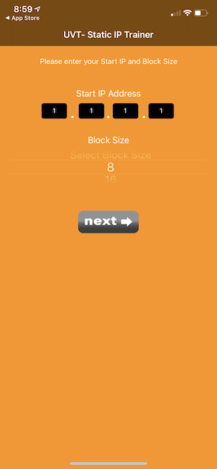
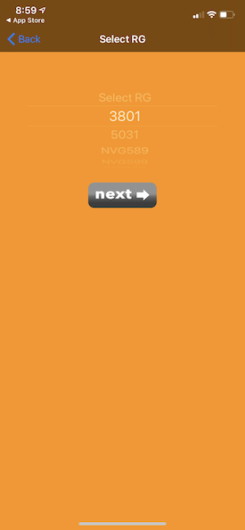
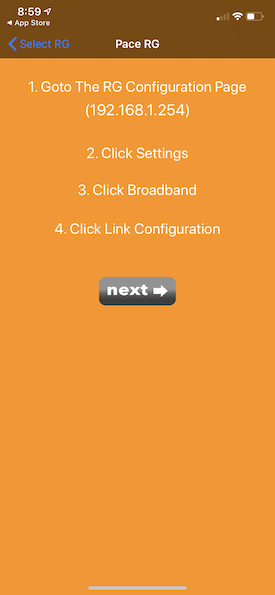
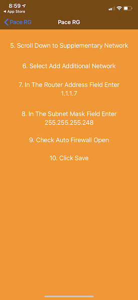
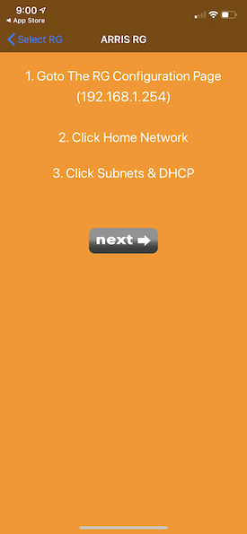
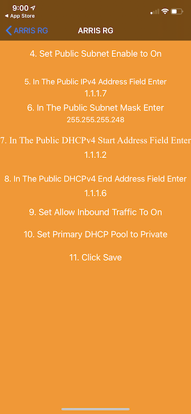

# UV Static IP Trainer
	Walks you thru calculating and programing public static IP addresses on a UV Residential Gateway. Version 15.0 allows you to share the static IP information. Note: the share only shares the information about the IPs (first usable, last usable, gateway, subnet mask, and DNS Servers). Sharing instructions will be available in a future release.

## Screenshots
| PACE RG| |||
| ----------------- | ----------------- | ----------------- | ----------------- |
| Home Screen | Select RG | Ins. Page 1 | Ins. Page 2 |
|  |  |  |  |

| ARRIS RG| |||
| ----------------- | ----------------- | ----------------- | ----------------- |
| Home Screen | Select RG | Ins. Page 1 | Ins. Page 2 |
|  |  |  |  |

## Third Party Frameworks Used
-   [KumpeHelpers](https://github.com/kumpeapps/KumpeHelpers)
-   [PBTutorialManager](https://github.com/paul1893/PBTutorialManager)

## Instructions
